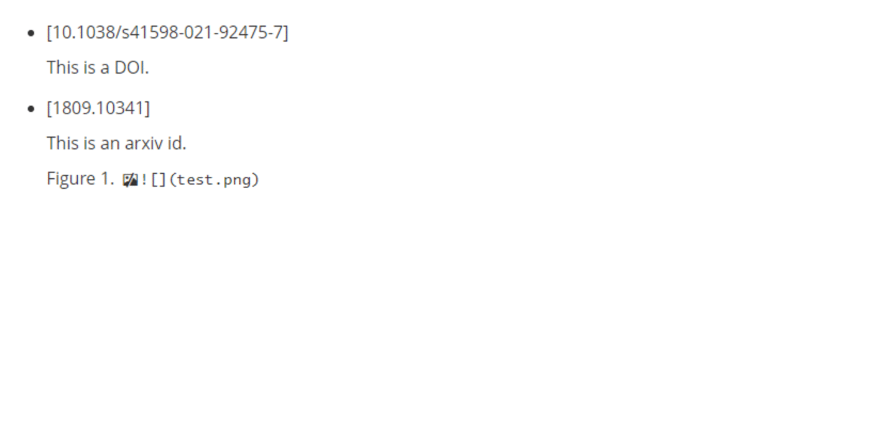

# autoLiterature
**autoLiterature**是一个基于Dropbox和Python的自动文献管理器。Inspired by [Mu Li](https://www.bilibili.com/video/BV1nA41157y4). 



**note.md被替换的三种情况：**
```
# 情况一, 已发表文献，拥有DOI，识别规则为  r'- \[.*\]'
- [10.1038/s41598-021-92475-7]
# 情况二, 未发表文献，拥有arxiv_id，识别规则为  r'- \[.*\]'。请勿在arxiv_id后添加版本号，比如1809.10341v2。
- [1809.10341]
# 情况三，本地或者服务器图片链接， 识别规则为  r"\(.*?.png\)"
# 为了兼容服务器端，图片存放位置必须为Dropbox文件夹下。
# 比如，放在HOME/Dropbox/*.png，在note.md中用*.png指代。
  # autoLiterature会自动上传Home/Dropbox/your_picture.png 
```

**麻烦使用[该邀请链接Dropbox](https://www.dropbox.com/referrals/AADHfuWXiW9pgDQs2L1aWAjUILZWznjXs2U?src=global9)注册Dropbox帐号，邀请者和被邀请者帐号都会增加一些空间。**

## 特点
- 自动抓取文献元信息，并下载文献
- 自动上传文献到Dropbox，并生成Dropbox分享链接
- 自动上传图片到Dropbox，并生成分享链接替
- 替换上述内容到笔记中相应的位置


## 安装
1. 下载软件
```bash
git clone https://github.com/WilmerWang/autoLiterature.git
cd autoliterature
```

2. 安装依赖项
```bash
conda create -n autoliter python  # 新建一个conda环境
conda activate autoliter  # 激活环境
pip install -r requirements.txt  # 安装依赖项
```
### 软件参数
```bash
(autoliter) Name@Cat:~/autoLiterature$ python main.py -h
usage: main.py [-h] [-p ROOT_PATH] [-k DROPBOX_ACCESS_TOKEN] [-t INTERVAL_TIME]

autoLiterature

optional arguments:
  -h, --help            show this help message and exit
  -p ROOT_PATH, --root_path ROOT_PATH
                        The path to the folder.
  -k DROPBOX_ACCESS_TOKEN, --dropbox_access_token DROPBOX_ACCESS_TOKEN
                        https://www.dropbox.com/developers/documentation/python#tutorial
  -t INTERVAL_TIME, --interval_time INTERVAL_TIME
                        The interval time for monitoring folder.

```

## 使用
1. 获得Dropbox API 的 **access token** 
    1. 注册[Dropbox](https://www.dropbox.com/referrals/AADHfuWXiW9pgDQs2L1aWAjUILZWznjXs2U?src=global9), 在[App Console](https://www.dropbox.com/developers/apps)注册一个新的应用。
    2. 进入应用中，选择`Permissions`选项，将`Files and folders`权限开到最大，比如勾上`files.metadata.write`, `files.content.write`, `sharing.write`, `file_requests.write`, `contacts.write`. 
    3. 选择应用中的`Settings`，勾选`Access token expiration`-->`No expiration`, 然后点`Generated access token` 生成一个永久**Access token**
2. 选择一个存放**文献笔记**的文件夹作为程序监视对象，比如`./note`, 选择监控频率`t s/epoch`.
3. 运行程序
    ```
    python main.py -p ./note -k your_access_token -t 1
    ```
    后台运行
    ```
    # Linux
    nohup python main.py -p ./note -k your_access_token -t 1 >main.log 2>&1 &

    #  Window
    pythonw main.py -p ./note -k your_access_token -t 1
    ```
4. 在`./note`中新建Markdown文件做文献笔记  
    1. 当文档中出现`- [DOI]`或者`- [Arxiv_id]`，比如`- [10.1038/s41598-021-92475-7]`的时候，autoLiterature会自动抓取文献信息，下载pdf并上传到Dropbox,写入文献笔记。
    2. 当文献中出现``的时候，autoLiterature会将本地或者服务器`HOME/Dropbox/*.png`图像推送到Dropbox，并生成共享链接来替换本地链接。

5. 同步attachment和note文件链接
    ```bash
    python scr/autosync.py
    ```

## 其它
### TODO
- [ ] 做成类似有道云笔记软件（写文献笔记发现开了太多md文件，很杂乱。并且希望后端在自己想pull文献的时候才跑，平常不跑）
- [x] 添加文章引用次数
- [x] enhance 对错误ID的鲁棒性

### 建议
- Dropbox，Arxiv, Sci-hub貌似国内网络都不太好，建议配置一个proxychains。`proxychains python main.py -p * -k * -t *`

